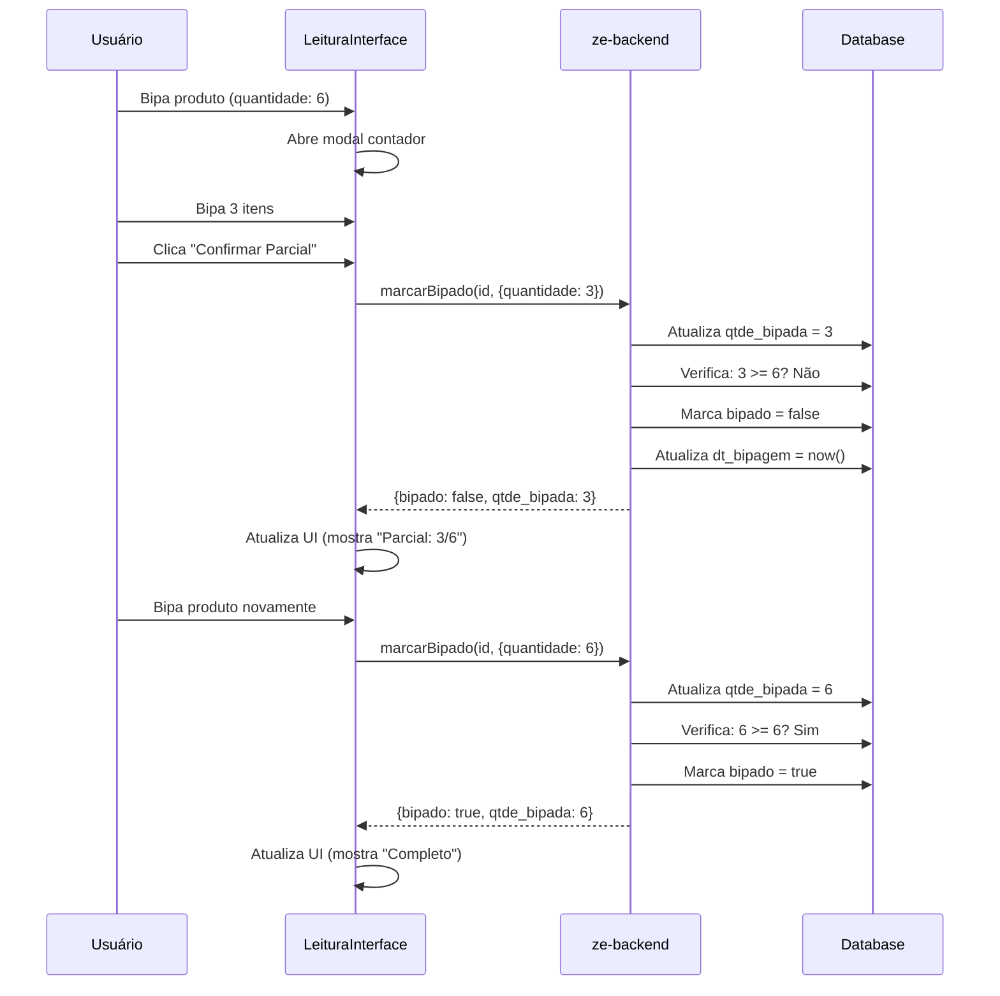

# Implementar Bipagem Parcial

## Problema Atual

Atualmente, o método `marcarBipado` no backend sempre marca `bipado = true` quando é chamado, independentemente da quantidade bipada. Isso impede bipagem parcial.

**Código atual (linha 265 e 323):**

```typescript
produtoGuarda.bipado = true; // Sempre true, mesmo com quantidade parcial
```

## Objetivo

Permitir que o usuário bipar parcialmente um produto (ex: 3 de 6) e fechar o modal. O campo `bipado` só deve ser `true` quando `qtde_bipada >= quantidade`.

## Estratégia: Backend (Recomendado)

Implementar a lógica no **backend** porque:

- Garante consistência dos dados
- Evita problemas de sincronização entre frontend e backend
- Centraliza a lógica de negócio (Clean Code)
- Mais seguro contra manipulação

## Implementação

### 1. Modificar `marcarBipado` em GuardaService (ze-backend)

**Arquivo**: `ze-backend/src/guarda/guarda.service.ts`

#### 1.1 Para ProdutosGuarda (guardas do SIAC)

Substituir a lógica atual (linhas 252-269) por:

```typescript
if (produtoGuarda) {
  // É um produto de guarda do SIAC
  this.logger.log(
    `[BIPAR] Produto do SIAC encontrado, atualizando bipagem...`,
    {
      id: produtoGuarda.id,
      id_siac: produtoGuarda.id_siac,
      sq_guarda: produtoGuarda.sq_guarda,
      bipado_atual: produtoGuarda.bipado,
      qtde_bipada_atual: produtoGuarda.qtde_bipada,
      quantidade_esperada: produtoGuarda.quantidade,
    },
  );

  // Atualizar quantidade bipada
  if (dados?.quantidade !== undefined) {
    // Se quantidade foi fornecida, usar ela (permite bipagem parcial)
    produtoGuarda.qtde_bipada = dados.quantidade;
  } else if (!produtoGuarda.bipado) {
    // Se não estava bipado e não mandou quantidade, incrementar em 1
    produtoGuarda.qtde_bipada = (produtoGuarda.qtde_bipada || 0) + 1;
  }
  // Se já estava bipado e não mandou quantidade, manter qtde_bipada atual

  // Marcar como bipado APENAS se qtde_bipada >= quantidade
  const quantidadeCompleta = produtoGuarda.qtde_bipada >= produtoGuarda.quantidade;
  produtoGuarda.bipado = quantidadeCompleta;
  
  // Atualizar dt_bipagem sempre que houver atualização (mesmo parcial)
  if (produtoGuarda.qtde_bipada > 0) {
    produtoGuarda.dt_bipagem = new Date();
  }
 
  if (dados?.endereco) {
    produtoGuarda.endereco_confirmado = dados.endereco;
  }

  const resultado = await this.produtosGuardaRepository.save(produtoGuarda);
  this.logger.log(`[BIPAR] Produto SIAC salvo com sucesso`, {
    id: resultado.id,
    bipado: resultado.bipado,
    qtde_bipada: resultado.qtde_bipada,
    quantidade: resultado.quantidade,
    completo: quantidadeCompleta,
  });

  // ... resto do código de retorno ...
}
```

#### 1.2 Para ProdNfc (guardas locais)

Substituir a lógica atual (linhas 323-333) por:

```typescript
// Se não encontrou em ProdutosGuarda, buscar em ProdNfc (guarda local)
this.logger.log(`[BIPAR] Buscando em ProdNfc (guarda local)...`);
const produtoNfc = await this.prodNfcRepository.findOne({
  where: { id: produtoId },
});

if (!produtoNfc) {
  this.logger.error(
    `[BIPAR] Produto com ID ${produtoId} não encontrado em nenhuma tabela`,
  );
  throw new NotFoundException(`Produto com ID ${produtoId} não encontrado`);
}

this.logger.log(
  `[BIPAR] Produto local encontrado, atualizando bipagem...`,
  {
    id: produtoNfc.id,
    item: produtoNfc.item,
    bipado_atual: produtoNfc.bipado,
    qtde_bipada_atual: produtoNfc.qtde_bipada,
    quantidade_esperada: produtoNfc.qtde,
  },
);

// Atualizar quantidade bipada
if (dados?.quantidade !== undefined) {
  // Se quantidade foi fornecida, usar ela (permite bipagem parcial)
  produtoNfc.qtde_bipada = dados.quantidade;
} else if (!produtoNfc.bipado) {
  // Se não estava bipado e não mandou quantidade, incrementar em 1
  produtoNfc.qtde_bipada = (produtoNfc.qtde_bipada || 0) + 1;
}

// Marcar como bipado APENAS se qtde_bipada >= quantidade
const quantidadeCompleta = produtoNfc.qtde_bipada >= produtoNfc.qtde;
produtoNfc.bipado = quantidadeCompleta;

// Atualizar dt_bipagem sempre que houver atualização (mesmo parcial)
if (produtoNfc.qtde_bipada > 0) {
  produtoNfc.dt_bipagem = new Date();
}

if (dados?.endereco) {
  produtoNfc.endereco_confirmado = dados.endereco;
}
if (dados?.guardaId) {
  produtoNfc.guarda_id = dados.guardaId;
}

const resultadoNfc = await this.prodNfcRepository.save(produtoNfc);
this.logger.log(`[BIPAR] Produto local salvo com sucesso`, {
  id: resultadoNfc.id,
  bipado: resultadoNfc.bipado,
  qtde_bipada: resultadoNfc.qtde_bipada,
  quantidade: resultadoNfc.qtde,
  completo: quantidadeCompleta,
});

// ... resto do código de retorno ...
```

### 2. Modificar Frontend para Permitir Fechar Modal com Quantidade Parcial

**Arquivo**: `ze-do-bip/app/leitura/_components/ModalContador.tsx`

#### 2.1 Modificar Botão Confirmar

Atualmente (linha 249), o botão "Confirmar" está desabilitado quando `quantidadeContada !== quantidadeEsperada`. Modificar para permitir confirmar com quantidade parcial:

```typescript
<Button
  title={quantidadeContada === quantidadeEsperada ? "Confirmar" : `Confirmar Parcial (${quantidadeContada}/${quantidadeEsperada})`}
  onPress={onConfirmar}
  disabled={quantidadeContada === 0} // Só desabilitar se não bipou nada
  style={[
    styles.modalConfirmButton,
    quantidadeContada === quantidadeEsperada && styles.modalConfirmButtonCompleto
  ]}
/>
```

#### 2.2 Adicionar Indicador Visual de Bipagem Parcial

Adicionar aviso quando quantidade for parcial:

```typescript
{quantidadeContada > 0 && quantidadeContada < quantidadeEsperada && (
  <View style={styles.partialWarning}>
    <Text style={styles.partialWarningText}>
      ⚠️ Bipagem parcial: {quantidadeContada} de {quantidadeEsperada} unidades
    </Text>
    <Text style={styles.partialWarningHint}>
      Você pode continuar bipando este produto depois
    </Text>
  </View>
)}
```

### 3. Modificar LeituraInterface para Lidar com Bipagem Parcial

**Arquivo**: `ze-do-bip/components/LeituraInterface.tsx`

#### 3.1 Modificar `fecharModalContador` para Aceitar Quantidade Parcial

Atualmente, a função valida se `quantidadeContada === produtoAtual.quantidade`. Modificar para aceitar qualquer quantidade > 0:

```typescript
const fecharModalContador = async () => {
  setContadorModal(false);
  setQuantidadeManual("");
  setValorModalInput("");

  // Permitir fechar mesmo com quantidade parcial
  if (quantidadeContada === 0) {
    // Se não bipou nada, apenas fechar
    resetarLeitura();
    return;
  }

  if (tipoInicial === "produto") {
    // Se iniciou por produto, precisa bipar endereço agora
    setEstadoLeitura("aguardando_endereco");
    setEnderecoModal(true);
  } else {
    // Se iniciou por endereço, produto está finalizado (mesmo que parcial)
    if (produtoAtual && guarda) {
      setProcessandoFinalizacao(true);

      Logger.debug(
        "LEITURA Finalizando produto (parcial ou completo):",
        produtoAtual.id,
        "Quantidade:",
        quantidadeContada,
        "Esperada:",
        produtoAtual.quantidade
      );

      // Persistir bipagem no backend (pode ser parcial)
      await marcarProdutoBipado(
        produtoAtual,
        quantidadeContada, // Pode ser parcial
        produtoAtual.endereco
      );

      // Atualizar estado local
      const produtosAtualizados = guarda.produtos.map((produto) => {
        if (produto.id === produtoAtual.id) {
          const novoQuantidadeLida = quantidadeContada;
          const completo = novoQuantidadeLida >= produto.quantidade;
          
          return {
            ...produto,
            quantidadeLida: novoQuantidadeLida,
            concluido: completo, // Só concluído se quantidade completa
            bipado: completo, // Sincronizar com backend
            dataLeitura: new Date().toISOString(),
          };
        }
        return produto;
      });

      setGuarda({
        ...guarda,
        produtos: produtosAtualizados,
      });

      Logger.debug(
        "LEITURA Estado local atualizado - produto bipado (parcial ou completo)"
      );

      // Atualizar contagem do backend e resetar
      setTimeout(async () => {
        await atualizarContagemBipados();
        setProcessandoFinalizacao(false);
        resetarLeitura();
      }, 100);
    }
  }
};
```

#### 3.2 Modificar `confirmarQuantidadeModal` para Aceitar Parcial

Remover a validação que exige quantidade exata:

```typescript
const confirmarQuantidadeModal = () => {
  if (!produtoAtual && !produtoAgrupadoAtual) return;

  // Permitir confirmar com qualquer quantidade > 0
  if (quantidadeContada === 0) {
    setErro("❌ Você precisa bipar pelo menos 1 item");
    return;
  }

  // Se quantidade for maior que esperada, avisar mas permitir
  const quantidadeEsperada = produtoAgrupadoAtual 
    ? produtoAgrupadoAtual.quantidadeTotal 
    : produtoAtual?.quantidade || 0;
  
  if (quantidadeContada > quantidadeEsperada) {
    Alert.alert(
      "⚠️ Quantidade maior que esperada",
      `Você bipou ${quantidadeContada} itens, mas a quantidade esperada é ${quantidadeEsperada}. Deseja continuar?`,
      [
        { text: "Cancelar", style: "cancel" },
        { 
          text: "Confirmar", 
          onPress: () => fecharModalContador() 
        },
      ]
    );
    return;
  }

  // Fechar modal (pode ser parcial)
  fecharModalContador();
};
```

### 4. Atualizar Exibição de Produtos para Mostrar Status Parcial

**Arquivo**: `ze-do-bip/app/leitura/_components/ListaProdutos.tsx` ou `ItemProduto.tsx`

Adicionar indicador visual para produtos parcialmente bipados:

```typescript
// No componente de item do produto
{produto.quantidadeLida > 0 && produto.quantidadeLida < produto.quantidade && (
  <View style={styles.partialBadge}>
    <Text style={styles.partialBadgeText}>
      Parcial: {produto.quantidadeLida}/{produto.quantidade}
    </Text>
  </View>
)}
```

### 5. Permitir Continuar Bipagem de Produto Parcial

**Arquivo**: `ze-do-bip/services/CodigoProcessorService.ts`

Modificar `buscarProduto` para permitir encontrar produtos parcialmente bipados:

```typescript
// Atualmente (linha 77), pula produtos concluídos
if (produto.concluido) {
  continue;
}

// Modificar para permitir produtos parcialmente bipados
// Só pular se estiver completamente bipado
if (produto.concluido && produto.quantidadeLida >= produto.quantidade) {
  continue;
}
```

## Fluxo de Bipagem Parcial



## Considerações Importantes

1. **Validação de Quantidade**: O backend deve validar que `qtde_bipada <= quantidade` (não permitir mais que o esperado)
2. **Incremento vs. Valor Absoluto**: A implementação usa valor absoluto (`dados.quantidade`), não incremento. Se quiser incremento, precisa somar com `qtde_bipada` atual
3. **Compatibilidade**: Manter compatibilidade com código existente que pode não enviar `quantidade`
4. **Logs**: Adicionar logs detalhados para debug de bipagem parcial

## Testes Necessários

1. Bipar produto parcialmente (3 de 6) e verificar que `bipado = false`
2. Continuar bipagem do mesmo produto até completar (6 de 6) e verificar que `bipado = true`
3. Verificar que `dt_bipagem` é atualizado mesmo em bipagem parcial
4. Testar com produtos agrupados
5. Verificar que produtos parcialmente bipados aparecem na lista como "parcial"

## Arquivos a Modificar

- `ze-backend/src/guarda/guarda.service.ts` - Modificar lógica de `marcarBipado` (ProdutosGuarda e ProdNfc)
- `ze-do-bip/app/leitura/_components/ModalContador.tsx` - Permitir confirmar com quantidade parcial
- `ze-do-bip/components/LeituraInterface.tsx` - Aceitar bipagem parcial em `fecharModalContador` e `confirmarQuantidadeModal`
- `ze-do-bip/services/CodigoProcessorService.ts` - Permitir encontrar produtos parcialmente bipados
- `ze-do-bip/app/leitura/_components/ItemProduto.tsx` ou `ListaProdutos.tsx` - Adicionar indicador visual de parcial

## Decisão de Design: Incremento vs. Valor Absoluto

**Opção A: Valor Absoluto (Implementado)**

- Frontend envia quantidade total bipada
- Backend substitui `qtde_bipada` pelo valor enviado
- Mais simples, mas requer frontend calcular total

**Opção B: Incremento**

- Frontend envia quantidade a adicionar
- Backend soma com `qtde_bipada` atual
- Mais flexível, mas pode ter problemas de sincronização

**Recomendação**: Usar **Valor Absoluto** para evitar problemas de sincronização e garantir consistência.